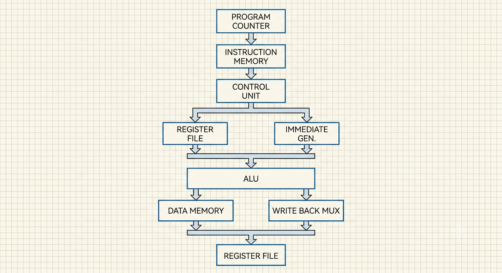

# 🚀 32-bit Single Cycle RISC-V Processor in Verilog

A 32-bit **Single Cycle RISC-V Processor** designed and implemented from scratch using **Verilog HDL**. This project demonstrates the fundamental architecture of a RISC-V CPU by implementing the instruction fetch, decode, execute, memory access, and write-back stages within a single clock cycle.

The processor follows a **modular design approach**, where each functional unit is implemented as an independent Verilog module, making the design easy to understand, debug, and extend.

---

# 📖 Project Overview

The objective of this project is to design a functional **single-cycle processor** capable of executing a subset of the **RV32I instruction set**.

Unlike pipelined processors, every instruction is completed in **one clock cycle**, making the architecture simple and ideal for learning processor design and computer architecture fundamentals.

The processor performs the complete instruction execution flow:

1. Fetch the instruction from instruction memory.
2. Decode the instruction.
3. Read operands from the register file.
4. Generate the required immediate value.
5. Perform arithmetic or logical operations using the ALU.
6. Access data memory for load/store instructions.
7. Write the result back to the destination register.
8. Update the Program Counter for the next instruction.

---

# ✨ Features

- 32-bit RISC-V Single Cycle Architecture
- Modular Verilog Implementation
- Separate Instruction and Data Memories
- 32 × 32-bit Register File
- Immediate Generator
- Arithmetic Logic Unit (ALU)
- ALU Decoder
- Main Control Unit
- Program Counter and Branch Logic
- Data Memory Interface
- Multiplexer-based Datapath
- Successfully simulated using Xilinx Vivado

---

# 🏗️ Processor Architecture

The processor consists of the following major blocks:


---

# 📂 Project Structure

```
RISCV-Single-Cycle-Processor
│
├── src
│   ├── alu.v
│   ├── alu_decoder.v
│   ├── branch_adder.v
│   ├── control_unit.v
│   ├── data_memory.v
│   ├── datapath.v
│   ├── imm_extend.v
│   ├── instruction_mem.v
│   ├── mux2.v
│   ├── pc_adder.v
│   ├── pcsrc_mux.v
│   ├── program_counter.v
│   ├── register_file.v
│   └── riscv_top.v
│
├── tb
│   └── riscv_top_tb.v
│
├── images
│   ├── architecture.png
│   └── waveform.png
│
├── README.md
├── LICENSE
└── .gitignore
```

---

# 🧩 Module Description

| Module | Function |
|---------|----------|
| **riscv_top.v** | Top-level module connecting the datapath and control unit |
| **datapath.v** | Implements the complete processor datapath |
| **control_unit.v** | Generates control signals based on the instruction opcode |
| **alu_decoder.v** | Determines the ALU operation using ALUOp and function fields |
| **alu.v** | Performs arithmetic and logical operations |
| **instruction_mem.v** | Stores the instruction program |
| **data_memory.v** | Stores data for load and store operations |
| **register_file.v** | Implements the 32-register register file |
| **program_counter.v** | Holds the address of the current instruction |
| **pc_adder.v** | Computes PC + 4 |
| **branch_adder.v** | Computes branch target address |
| **imm_extend.v** | Generates sign-extended immediate values |
| **mux2.v** | Generic 2-to-1 multiplexer |
| **pcsrc_mux.v** | Selects the next Program Counter value |

---

# 🧠 Supported Instructions

The processor currently supports the following RV32I instructions:

| Instruction | Type  | Description |
|------------|--------|-------------|
| ADD        | R-Type | Adds two registers |
| ADDI       | I-Type | Adds an immediate value to a register |
| LW         | I-Type | Loads a word from data memory |
| SW         | S-Type | Stores a word into data memory |
| BEQ        | B-Type | Branches when two registers are equal |

---

# 📝 Test Program

The following program was loaded into instruction memory for verification:

```assembly
addi x1, x0, 5
addi x2, x0, 10
add  x3, x1, x2
sw   x3, 0(x0)
lw   x4, 0(x0)
```

---

# ✅ Expected Results

After successful execution, the register values are:

| Register | Value |
|----------|-------|
| x1       | 5     |
| x2       | 10    |
| x3       | 15    |
| x4       | 15    |

Data Memory:

```
Memory[0] = 15
```

This confirms that:

- Register write operations work correctly.
- ALU performs arithmetic correctly.
- Store instruction writes data to memory.
- Load instruction retrieves data correctly.
- Write-back stage updates the destination register successfully.

---

# ▶️ Simulation

The processor was simulated using **Xilinx Vivado Simulator**.

Simulation verified:

- Instruction Fetch
- Instruction Decode
- Register Read
- Immediate Generation
- ALU Execution
- Memory Write
- Memory Read
- Register Write-back
- Program Counter Update

---

# ⚙️ Tools Used

- Verilog HDL
- Xilinx Vivado Design Suite
- Xilinx Simulator (XSIM)
- Git & GitHub

---

# 🚀 Future Improvements

Possible enhancements include:

- Complete RV32I Instruction Set
- Jump Instructions (JAL, JALR)
- Shift Instructions
- Pipeline Implementation
- Hazard Detection Unit
- Data Forwarding Unit
- Branch Prediction
- Cache Memory
- UART Peripheral
- Memory Initialization using HEX/MEM files

---

# 📚 Learning Outcomes

Through this project, the following concepts were explored:

- Computer Architecture
- Processor Datapath Design
- RISC-V ISA Fundamentals
- Control Signal Generation
- Verilog HDL Design
- Functional Simulation
- Processor Verification
- Modular Hardware Design

---

# 👩‍💻 Author

**Archita Roy**

Electronics and Communication Engineering  
National Institute of Technology Silchar

GitHub: https://github.com/archita-2005

---

# ⭐ Acknowledgement

This project was developed as a learning-oriented implementation of a **Single Cycle RISC-V Processor** to strengthen understanding of processor architecture, digital design, and Verilog HDL. It serves as a foundation for future work on pipelined processors and more advanced RISC-V implementations.
